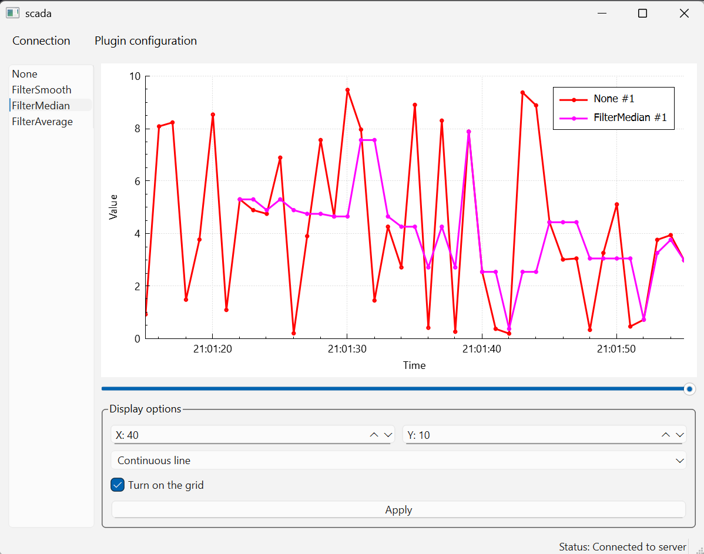

# SCADA

A simple SCADA-like application for real-time monitoring and visualization of measurement data.

## Features

- Quick startup using `main.bat`
- Real-time charting of incoming data
- Modular data processing
- Configurable chart display
- Data buffer for limited history and scrolling support

## How to Run

1. Clone the repository
2. Run the `main.bat` script

All required `.dll` files and binaries are included. No manual compilation is necessary.

## Stack

- C++
- Qt Creator
- Qt (networking, GUI)
- QChart / QCustomPlot
- exprtk
- Windows (MinGW)

## License

MIT
